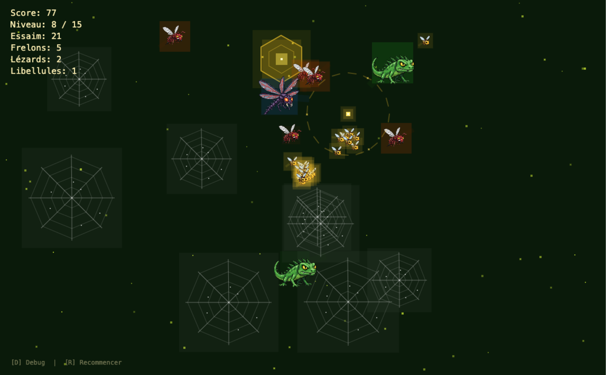

# La Reine des Abeilles

> **English version available:** [README.md](README.md)

Un jeu en pixel art jouable dans le navigateur. Vous incarnez la Reine des Abeilles et devez guider votre essaim à travers un jardin rempli de dangers.

**Jouer au jeu :** [itch.io](https://wahibonae.itch.io/bee-pixel-game) -
**Voir la vidéo :** [YouTube](https://www.youtube.com/watch?v=odTDjEG52OY)

[](https://www.youtube.com/watch?v=odTDjEG52OY)

## Présentation

Vous contrôlez la Reine avec votre souris. Vos abeilles ouvrières vous suivent à travers un jardin peuplé de prédateurs et de toiles d'araignée. Guidez-les jusqu'à l'entrée de la ruche pour les sauver. Survivez à 15 niveaux de difficulté croissante.

Créé par **Mohamed Wahib ABKARI**. Un grand merci à Mr. Michel Buffa pour son enseignement, son aide et son soutien.

## Comment jouer

1. Ouvrir `index.html` dans un navigateur
2. Lire les instructions, appuyer sur **[U]**
3. Consulter les prédateurs, appuyer sur **[U]**
4. Appuyer sur **[S]** pour lancer chaque niveau
5. Appuyer sur **[R]** pour recommencer un niveau

### Contrôles

| Touche | Action |
|--------|--------|
| Souris | Déplacer la Reine |
| U | Valider les écrans d'instructions |
| S | Lancer le niveau |
| R | Recommencer le niveau en cours |
| D | Activer/désactiver le mode debug |

## Comportements de pilotage (Craig Reynolds)

Ce jeu met en place les comportements d'agents autonomes suivants, basés sur les travaux de Craig Reynolds :

| Comportement | Fonctionnement |
|--------------|----------------|
| **Seek (Recherche)** | Les ouvrières sont attirées vers la Reine (curseur de la souris). Plus elles sont loin, plus la force d'attraction est grande. |
| **Flee (Fuite)** | Les ouvrières fuient les prédateurs proches. L'urgence augmente avec la proximité. |
| **Pursue (Poursuite)** | Les prédateurs anticipent la position future de l'abeille la plus proche et se dirigent vers ce point, au lieu de suivre sa position actuelle. |
| **Evade (Esquive)** | Les prédateurs fuient la Reine quand elle s'approche trop (cercle de protection par phéromones). |
| **Wander (Errance)** | Les prédateurs patrouillent dans le jardin en utilisant un cercle projeté devant leur vélocité, avec un angle aléatoire qui change à chaque image. |
| **Flocking (Vol groupé)** | Les ouvrières suivent les trois règles de Reynolds : **Alignement** (suivre la direction des voisines), **Cohésion** (se rapprocher du centre des voisines), **Séparation** (ne pas se coller aux autres). |
| **Obstacle Avoidance (Évitement d'obstacles)** | Tous les agents utilisent deux points d'anticipation projetés le long de leur vélocité pour détecter et contourner les toiles d'araignée. |
| **Arrival (Arrivée)** | Le curseur de la Reine décélère progressivement en s'approchant de la position de la souris, grâce à une zone de freinage qui adapte la vitesse à la distance. |
| **Boundaries (Limites)** | Les ouvrières s'éloignent des bords du jardin pour rester dans la zone de jeu. |

## Structure du projet

```
index.html        Point d'entrée
sketch.js          Boucle de jeu, niveaux, interface, écrans, particules
boid.js            Abeille ouvrière (flocking, seek, flee, avoid, boundaries)
predator.js        Prédateurs (pursue, evade, wander, avoid) - 4 types
obstacle.js        Rendu des toiles d'araignée
portal.js          Rendu de l'entrée de la ruche
style.css          Style du fond
assets/            Sprites (.png), effets sonores (.wav), musique (.mp3)
libraries/         p5.js, p5.sound
```

## Types de prédateurs

| Type | Apparition | Vitesse | Détection | Comportement |
|------|------------|---------|-----------|--------------|
| Frelon | Niveau 1 | Moyenne (augmente avec le niveau) | 150px | Rapide, chasse en groupe |
| Lézard | Niveau 5 | Lente | 200px | Endurant, grande zone de détection |
| Libellule | Niveau 8 | Rapide | 180px | Très rapide, difficile à semer |
| Araignée | Niveau 12 | Très lente | 250px | Lente mais mortelle, force de capture énorme |

## Technologies

- **p5.js** pour le rendu graphique et la boucle de jeu
- **p5.sound** pour les effets sonores et la musique
- Style pixel art : `noSmooth()`, `pixelDensity(1)`, arrondi avec `floor()`

## Difficultés rencontrées

- **Équilibrage de la vitesse des prédateurs** : Trouver la bonne vitesse pour chaque type de prédateur sur 15 niveaux, car les frelons semblaient injustes quand ils étaient trop rapides dans les premiers niveaux. On a ajouté une montée en vitesse progressive (50% au niveau 1, vitesse maximale au niveau 3).
- **Abeilles apparaissant dans les obstacles** : Lors du passage entre les niveaux, les nouveaux obstacles se plaçaient parfois sur des abeilles existantes, ce qui les tuait avant que le joueur puisse réagir. On a corrigé ceci en déplaçant les abeilles vers une position sûre près de la reine après le placement des obstacles.

## Ce dont je suis le plus fier

Avoir mis en place les suggestions de Mr. Michel Buffa, qui ont transformé le jeu d'une simple démo de boids en un jeu complet et abouti :
- **Introduction progressive des prédateurs** sur 15 niveaux (4 types distincts de prédateurs)
- **Sound design** avec des effets sonores 8-bit pour chaque événement du jeu (abeille sauvée, mort d'abeille, niveau terminé, game over, victoire)
- **Musique de fond** qui change entre le menu et le gameplay (générée par IA avec Suno)
- Le résultat est un jeu qui donne une impression de produit fini et qui est amusant à jouer, pas juste une démo technique.

## Outils d'IA utilisés

### Claude Code (Anthropic)

Le jeu a été développé avec l'aide de [Claude Code](https://claude.com/product/claude-code), l'assistant de programmation d'Anthropic.

Utilisé pour le refactoring du code, la conversion en style pixel art, la recherche et correction de bugs, et les suggestions de game design.

**Exemples de prompts utilisés :**

> "the current game is a cosmic game that combines the mechanisms shared by Craig Reynolds. Please make these small fixes: more obstacles as levels progress, add a protection circle around the mouse"

> "we should have 15 levels: 1 to 5 wasps and obstacles, 6 to 12 wasps and obstacles and new predators, 13 to 15 wasps and obstacles and lizards and dragonflies and big spiders"

> "there is still that issue of the game continuing to create hives even after the threshold has been reached. Please investigate what's happening and find exactly what causes this issue and think of the best solutions that are minimal and 100% working in all edge cases."

### Suno

[Suno](https://suno.com/) a été utilisé pour générer la musique de fond 8-bit du menu et du gameplay à partir de descriptions textuelles du style et de l'ambiance souhaitée.

## Crédits

- Jeu créé par : **Mohamed Wahib ABKARI**
- Remerciements à Mr. [Michel Buffa](https://users.polytech.unice.fr/~buffa/) pour son enseignement, ses conseils et son soutien.
- Développé avec [p5.js](https://p5js.org/)
- Comportements de pilotage par Craig Reynolds
- Musique du menu et du jeu générée avec [Suno](https://suno.com/)
